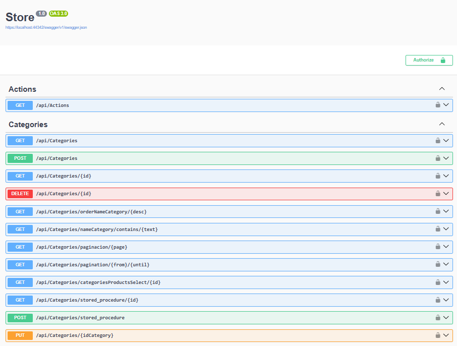
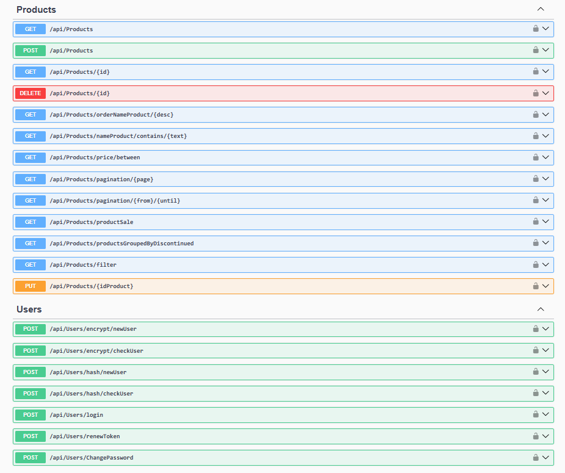

## Store_MySQL

**Store_MySQL** is an ASP.NET Core web API for a store, managing categories, products, and users. It includes controllers for CRUD operations and features such as pagination, filtering, image file management, and JWT authentication/authorization. It implements services for action logging, file management, password encryption and hashing, and a scheduled task. Entity Framework Core is configured for interaction with a MySQL database, with DTOs for data transfer and validators for data input. Finally, development and production configurations, a Dockerfile, and a Docker-Compose for container deployment are provided.


Store_MySQL/    
├───Classes/  
│   └───ResultHash.cs  
├───Controllers/  
│   ├───ActionsController.cs  
│   ├───CategoriesController.cs  
│   ├───ProductsController.cs  
│   └───UsersController.cs  
├───DTOs/  
│   ├───CategoryDTO.cs  
│   ├───CategoryInsertDTO.cs  
│   ├───CategoryItemDTO.cs  
│   ├───CategoryProductDTO.cs  
│   ├───CategoryUpdateDTO.cs  
│   ├───LoginResponseDTO.cs  
│   ├───ProductDTO.cs  
│   ├───ProductFilterDTO.cs  
│   ├───ProductInsertDTO.cs  
│   ├───ProductSaleDTO.cs  
│   ├───ProductUpdateDTO.cs  
│   ├───UserChangePasswordDTO.cs  
│   └───UserDTO.cs  
├───Filters/  
│   └───ExceptionFilter.cs  
├───Middlewares/  
│   └───RegisterAndControlMiddleware.cs  
├───Models/  
│   ├───Action.cs  
│   ├───Category.cs  
│   ├───Product.cs  
│   ├───StoreContext.cs  
│   └───User.cs  
├───Services/  
│   ├───ActionsService.cs  
│   ├───FileManagerService.cs  
│   ├───HashService.cs  
│   ├───IFileManagerService.cs  
│   ├───ScheduledTaskService.cs  
│   └───TokenService.cs  
├───Validators/  
│   ├───GroupFileType.cs  
│   ├───ValidationFileType.cs  
│   └───WeightFileValidation.cs  
├───appsettings.Development.json  
├───appsettings.json  
├───Dockerfile  
└───Program.cs  






## Program
``` 
var connectionString = builder.Configuration.GetConnectionString("Connection");

builder.Services.AddDbContext<StoreContext>(options =>
    options.UseMySql(connectionString, new MySqlServerVersion(new Version(8, 0, 31)));
);
``` 


## appsetting.Development.json
``` 
{
  "ConnectionStrings": {
    "Connection": "Server=localhost;Port=3306;Database=store;User=root;Password=root"
  }
}
``` 


[DeepWiki moraisLuismNet/Store_MySQL](https://deepwiki.com/moraisLuismNet/Store_MySQL)