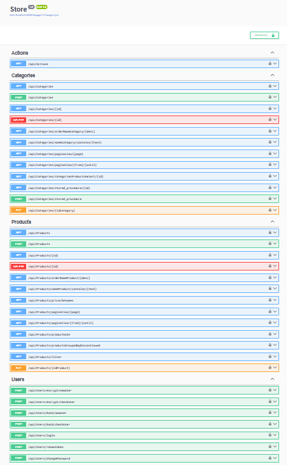

## Store
ASP.NET Core Web API Store



## appsetting.Development.json
``` 
{
    "ConnectionStrings": {
        "Connection": "Data Source=W11P0rt;Initial Catalog=Store;Integrated Security=True;Encrypt=False"
    },
    "Logging": {
        "LogLevel": {
            "Default": "Information",
            "Microsoft.AspNetCore": "Warning"
        }
    }
}
``` 
